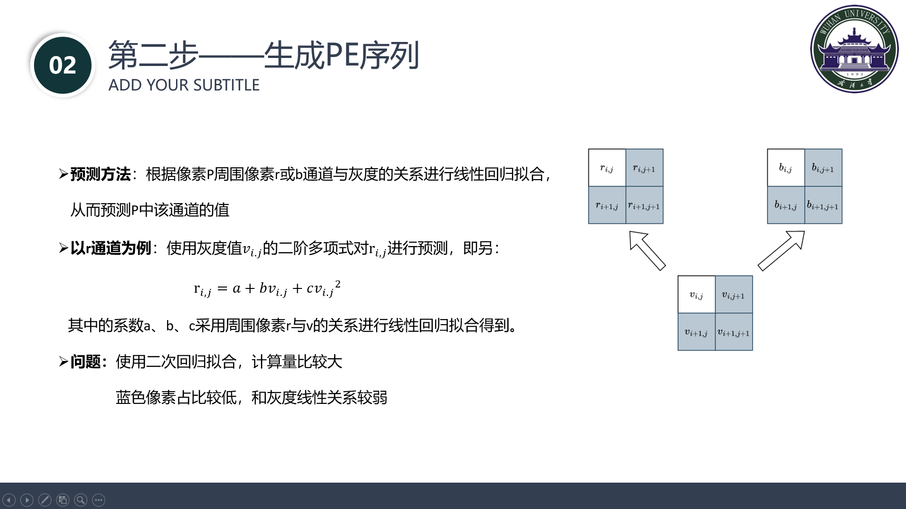
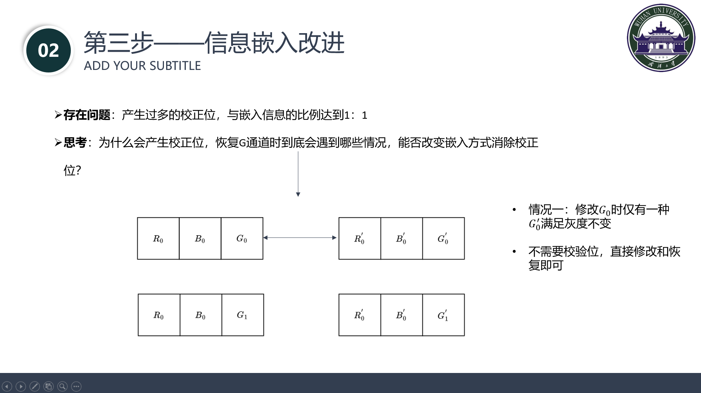
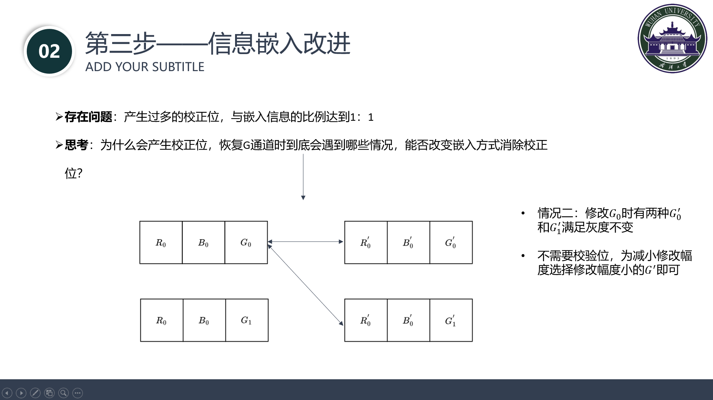
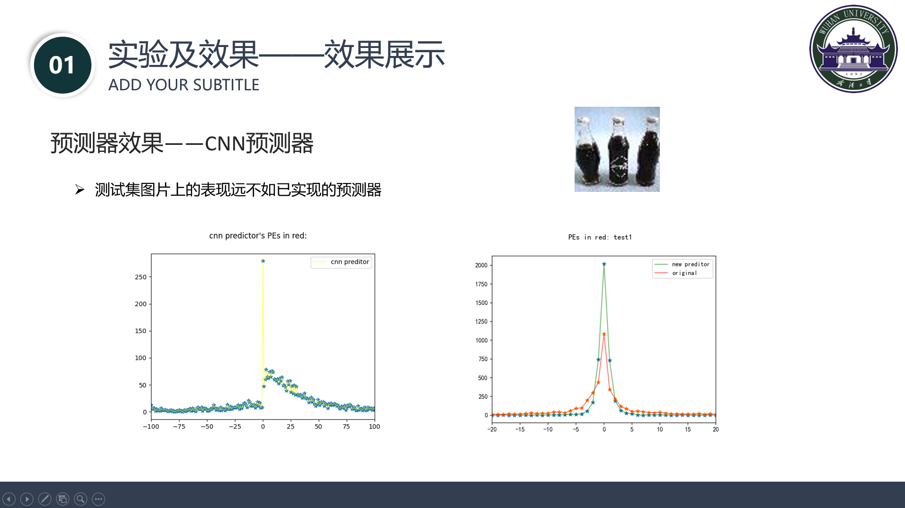

# 2022  WHU IH course project 
> An implement based Python 3.7+ about [RDH in Color Image With Grayscale Invariance](http://home.ustc.edu.cn/~houdd/PDF/Reversible%20Data%20Hiding%20in%20Color%20Image%20with%20Grayscale%20Invariance.pdf) by *Dongdong Hou , Weiming Zhang , Kejiang Chen, Sian-Jheng Lin, and Nenghai Yu*
## Folder description :

"result_images":  			   文件夹中是产生的结果图片

​	"test_images":				   文件夹中是项目中使用的测试图片

​    "encode.py":                      对秘密信息进行二进制编解码

​    "start.py":         			   	参考文献中方案的实现

​	"start_advance.py":           改进方案的实现

​	"psnr.py":			 				两种方案产生的图片的psnr对比程序

​	”sift.py“：						     sift测试的匹配程序

​	”predict_test.py":                两种传统方法预测器效果对比代码

### Basic Introduction

- 首先安装所依赖的库`python3 install -r requirements.txt`
- 其次执行`start.py/start_advance.py`对图像进行加密解密
- 下面是执行时控制台样例输出
```python
=> Finish reading image!
=> Finish calculating predication error!
=> Message: 314159265659314159265659
=> Finish embeding msg with the critical value of ⍴ being 2
=> Finish embeding parameters:
        rhoT: 2, lastEc: 1, La: 193, N: 193, tagsCode: 0000000000000000100000000000000000000000000000000000000000000000000000000000000000000000000000000000000000000000000000000000000000000000000000000000000000000000000000000000000000000000000000000
=> Finish reading embeded image and calculating predication error!
=> Ensure the grayscale invariant: True
=> Finish extractig parameters:
        rhoT: 2, lastEc: 1, La: 193, N: 193, tagsCode: 0000000000000000100000000000000000000000000000000000000000000000000000000000000000000000000000000000000000000000000000000000000000000000000000000000000000000000000000000000000000000000000000000
=> Finish extracting received msg: 314159265659314159265659
=> The msg is equal to received msg: True
```
- 程序会生成并保存灰度对比图`Grayscale.png`

- 下面是程序加密前后的图片对比，可以看到人眼是很难看出来变化
<figure class="half">
    
    
</figure>
### Report












### Others
> Motivation: This is the final project of class **Information  Hiding**
>
> Stars Wanted: If it can run on your machine, please **star** this project!
